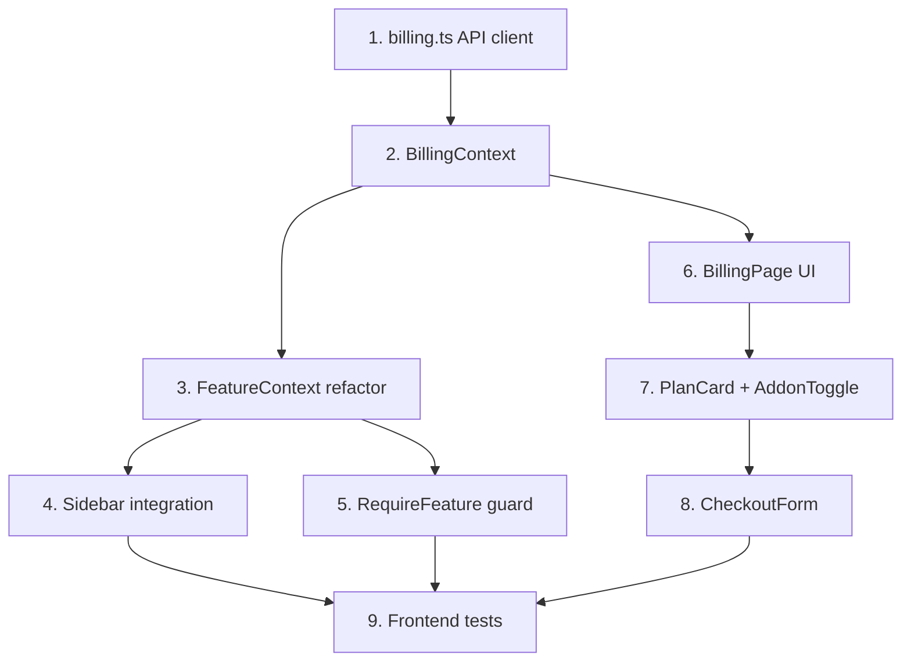

# Frontend Billing Implementation Guide

## 📋 Document Purpose

This guide provides comprehensive instructions for AI coding agents to implement the **Phase 1.5 Frontend Billing Integration** for TimePerk Cortex's multi-tenant SaaS platform.

**Source**: `docs/TASK LIST BILLING FRONTEND.md` (JSON specification)  
**Target**: React 18 + TypeScript frontend consuming Laravel 11 billing API  
**Prerequisites**: Backend Phase 1 complete (Pennant features + billing endpoints)

---

## 🎯 Project Overview

### What We're Building

A complete React-based billing and feature management interface that:

1. **Consumes Backend API**: Integrates with 5 billing endpoints from Phase 1
2. **Manages Subscriptions**: Displays plans, addons, pricing, and checkout flows
3. **Controls Feature Access**: Uses Pennant feature flags to show/hide modules (Travels, Planning, AI)
4. **Zero Breaking Changes**: Adds new functionality without modifying existing auth/routing

### Architecture Philosophy

**Single Source of Truth**: Backend API defines all business logic (plans, pricing, features)  
**Frontend Role**: Display state + trigger actions (no plan logic duplication)  
**Separation of Concerns**: BillingContext (mutations) ≠ FeatureContext (computed flags)

---

## 🏗️ Proposed Architecture

### Directory Structure

```
frontend/src/
├── api/
│   └── billing.ts                    # Isolated HTTP calls (5 functions)
├── contexts/
│   ├── BillingContext.tsx           # State + mutations (plan, addons, checkout)
│   └── FeatureContext.tsx           # Read-only computed flags (hasTravels, etc.)
├── components/
│   ├── Billing/
│   │   ├── BillingPage.tsx          # Main UI (plans grid + addons + checkout)
│   │   ├── PlanCard.tsx             # Individual plan card component
│   │   ├── AddonToggle.tsx          # Switch for Planning/AI addons
│   │   ├── CheckoutForm.tsx         # Fake credit card form
│   │   └── PricingSummary.tsx       # Price breakdown (base + addons + total)
│   ├── Guards/
│   │   ├── RequireFeature.tsx       # HOC/wrapper for protected routes
│   │   └── LockedModuleBanner.tsx   # UI when feature is disabled
│   └── Layout/
│       └── Sidebar.tsx              # Update to use FeatureContext
├── hooks/
│   ├── useBilling.ts                # Shortcut for useContext(BillingContext)
│   └── useFeatures.ts               # Shortcut for useContext(FeatureContext)
└── types/
    └── billing.ts                   # TypeScript interfaces
```

---

## 📐 Critical Design Patterns

### 1. Separation: BillingContext vs FeatureContext

**❌ WRONG - Mixing billing state with feature flags:**

```typescript
const BillingContext = {
  plan: 'team',
  hasTravels: true,  // ← DUPLICATION - logic exists in 2 places
  toggleAddon: () => {}
}
```

**✅ CORRECT - Clear separation:**

```typescript
// BillingContext: State + mutations
const BillingContext = {
  summary: { plan, users, modules_enabled, addons, total },
  upgradePlan: (newPlan) => {},
  toggleAddon: (addon) => {},
  startCheckout: () => {}
}

// FeatureContext: Computed from BillingContext.summary.modules_enabled
const FeatureContext = {
  hasTravels: computed(() => modules_enabled.includes('travels')),
  hasPlanning: computed(() => modules_enabled.includes('planning')),
  hasAI: computed(() => modules_enabled.includes('ai'))
}
```

**Why this matters**: Prevents logic duplication and ensures backend API is single source of truth.

---

### 2. Single Source of Truth (Backend API)

**✅ CORRECT - Feature flags derived from backend:**

```typescript
useEffect(() => {
  const summary = await getBillingSummary();
  // summary.modules_enabled = ['timesheets', 'expenses', 'travels']
  // Frontend only computes boolean flags from this array
}, []);
```

**❌ WRONG - Hardcoded logic in frontend:**

```typescript
const hasTravels = plan === 'team' || plan === 'enterprise'; // ← DUPLICATES BACKEND LOGIC
```

**Why this matters**: If backend business rules change (e.g., "Starter >2 users unlocks Travels"), frontend automatically reflects it.

---

### 3. RequireFeature Pattern

**✅ CORRECT - Reusable guard component:**

```tsx
<RequireFeature feature="travels" fallback={<LockedModuleBanner />}>
  <TravelsPage />
</RequireFeature>
```

**❌ WRONG - Logic scattered across components:**

```tsx
const TravelsPage = () => {
  const { hasTravels } = useFeatures();
  if (!hasTravels) return <div>Locked</div>; // ← DUPLICATED IN EVERY COMPONENT
};
```

**Why this matters**: Centralized access control, easier to audit, consistent UX.

---

### 4. Checkout Flow (Fake Payment)

**Simplified for development (Phase 1.5):**

```tsx
const CheckoutForm = () => {
  const [cardNumber, setCardNumber] = useState('4242424242424242');
  
  const handleConfirm = async () => {
    // Backend validates but accepts any card number
    await confirmCheckout({ card_number: cardNumber });
  };
};
```

**Why this matters**: Avoids payment gateway integration complexity in Phase 1. Real payment integration comes later.

---

## 🔧 TypeScript Interfaces

### Core Types (`src/types/billing.ts`)

```typescript
export interface BillingSummary {
  plan: 'starter' | 'team' | 'enterprise';
  users: number;
  modules_enabled: string[];  // ['timesheets', 'expenses', 'travels', 'planning', 'ai']
  addons: string[];           // ['planning', 'ai']
  base_subtotal: number;      // €35 or €35 * users
  total: number;              // base + 18% planning + 18% ai
  requires_upgrade: boolean;
}

export interface BillingContextValue {
  summary: BillingSummary | null;
  loading: boolean;
  error: string | null;
  refreshSummary: () => Promise<void>;
  upgradePlan: (newPlan: string) => Promise<void>;
  toggleAddon: (addon: string) => Promise<void>;
  startCheckout: () => Promise<{ session_id: string }>;
  confirmCheckout: (data: CheckoutData) => Promise<void>;
}

export interface FeatureContextValue {
  hasTravels: boolean;
  hasPlanning: boolean;
  hasAI: boolean;
}

export interface CheckoutData {
  card_number: string;
  card_expiry?: string;
  card_cvc?: string;
}
```

---

## 📝 Implementation Order (Dependency Graph)



### Justification for This Order

1. **API client first**: Foundation - all other code depends on this
2. **Contexts before UI**: Establishes data flow patterns
3. **Guards before protected pages**: Security layer must exist first
4. **Complete UI after contexts stable**: Prevents refactoring
5. **Tests at end of each phase**: Validates entire flow

---

## 🚀 Phase 1.5 Implementation Tasks

### Task 1: Billing API Client (`frontend-bootstrap` + `billing-api-client`)

**File**: `src/api/billing.ts`

**Responsibilities**:
- Isolated HTTP calls to backend billing endpoints
- Type-safe request/response handling
- Centralized error normalization

**Functions to implement**:

```typescript
export async function getBillingSummary(): Promise<BillingSummary>
export async function upgradePlan(newPlan: string): Promise<void>
export async function toggleAddon(addon: string): Promise<void>
export async function startCheckout(): Promise<{ session_id: string }>
export async function confirmCheckout(data: CheckoutData): Promise<void>
```

**Critical requirements**:
- Use existing axios instance from `src/services/api.ts` (auto-injects `X-Tenant` header)
- Return typed responses
- Normalize backend errors to consistent format
- NO business logic here - just HTTP calls

---

### Task 2: BillingContext (`billing-context`)

**File**: `src/contexts/BillingContext.tsx`

**Responsibilities**:
- Centralized billing state management
- Mutation functions (upgrade, toggle addon, checkout)
- Loading/error state handling

**State shape**:

```typescript
{
  billingSummary: BillingSummary | null,
  loading: boolean,
  error: string | null,
  refreshSummary: () => Promise<void>,
  upgradePlan: (newPlan: string) => Promise<void>,
  toggleAddon: (addon: string) => Promise<void>,
  startCheckout: () => Promise<{ session_id: string }>,
  confirmCheckout: (data: CheckoutData) => Promise<void>
}
```

**Critical requirements**:
- Wrap app (or billing routes) with `<BillingContext.Provider>`
- Fetch summary on mount
- Auto-refresh after mutations (upgradePlan, toggleAddon, confirmCheckout)
- NO UI logic embedded here

---

### Task 3: FeatureContext Refactor (`feature-context-update`)

**File**: `src/contexts/FeatureContext.tsx`

**Responsibilities**:
- Derive module flags from `BillingContext.summary.modules_enabled`
- Provide computed boolean flags for UI consumption
- Read-only (no mutations)

**Computed flags**:

```typescript
const hasTravels = useMemo(() => 
  summary?.modules_enabled.includes('travels') ?? false, 
  [summary]
);

const hasPlanning = useMemo(() => 
  summary?.modules_enabled.includes('planning') ?? false, 
  [summary]
);

const hasAI = useMemo(() => 
  summary?.modules_enabled.includes('ai') ?? false, 
  [summary]
);
```

**Critical requirements**:
- Depends on BillingContext (must be nested inside `<BillingContext.Provider>`)
- Mark old feature flag logic as deprecated
- NO mutations allowed in this context

---

### Task 4: Sidebar Integration (`sidebar-integration`)

**File**: `src/components/Layout/Sidebar.tsx`

**Responsibilities**:
- Show/hide navigation items based on FeatureContext flags
- NO hardcoded plan names or module logic

**Example pattern**:

```tsx
const { hasTravels, hasPlanning, hasAI } = useFeatures();

return (
  <nav>
    <NavLink to="/timesheets">Timesheets</NavLink>
    <NavLink to="/expenses">Expenses</NavLink>
    
    {hasTravels && <NavLink to="/travels">Travels</NavLink>}
    {hasPlanning && <NavLink to="/planning">Planning</NavLink>}
    {hasAI && <NavLink to="/ai">AI Insights</NavLink>}
  </nav>
);
```

---

### Task 5: Module Guards (`module-guards`)

**Files**: 
- `src/components/Guards/RequireFeature.tsx`
- `src/components/Guards/LockedModuleBanner.tsx`

**Responsibilities**:
- Wrap protected routes (Travels, Planning, AI)
- Render fallback UI when feature is disabled
- Redirect or show upgrade prompt

**Example implementation**:

```tsx
interface RequireFeatureProps {
  feature: 'travels' | 'planning' | 'ai';
  fallback?: React.ReactNode;
  children: React.ReactNode;
}

export const RequireFeature: React.FC<RequireFeatureProps> = ({ 
  feature, 
  fallback = <LockedModuleBanner feature={feature} />, 
  children 
}) => {
  const features = useFeatures();
  
  const isEnabled = {
    travels: features.hasTravels,
    planning: features.hasPlanning,
    ai: features.hasAI,
  }[feature];
  
  return isEnabled ? <>{children}</> : fallback;
};
```

**Usage in routes**:

```tsx
<Route path="/travels/*" element={
  <RequireFeature feature="travels">
    <TravelsPage />
  </RequireFeature>
} />
```

---

### Task 6: BillingPage UI (`billing-page-ui`)

**File**: `src/components/Billing/BillingPage.tsx`

**Responsibilities**:
- Main billing management interface
- Display current plan, users, addons, pricing
- Provide UI to upgrade plan, toggle addons, checkout

**Layout structure**:

```tsx
<BillingPage>
  <CurrentPlanSection>
    {/* Show current plan, user count, renewal date */}
  </CurrentPlanSection>
  
  <PlansGrid>
    <PlanCard plan="starter" />
    <PlanCard plan="team" current />
    <PlanCard plan="enterprise" />
  </PlansGrid>
  
  <AddonsSection>
    <AddonToggle addon="planning" />
    <AddonToggle addon="ai" />
  </AddonsSection>
  
  <PricingSummary summary={billingSummary} />
  
  {requiresCheckout && <CheckoutForm />}
</BillingPage>
```

**Critical requirements**:
- Use BillingContext for all state/mutations
- No hardcoded prices (read from `billingSummary`)
- Responsive layout (Material-UI Grid)

---

### Task 7: Atomic Components (`billing-page-ui` subtasks)

**Files**:
- `src/components/Billing/PlanCard.tsx`
- `src/components/Billing/AddonToggle.tsx`
- `src/components/Billing/PricingSummary.tsx`
- `src/components/Billing/CheckoutForm.tsx`

**PlanCard responsibilities**:
- Display plan name, price, features, user limit
- "Upgrade" button (disabled if current plan)
- Visual indicator for current plan

**AddonToggle responsibilities**:
- Switch component for Planning/AI addons
- Show addon price (+18%)
- Call `toggleAddon()` from BillingContext on change

**PricingSummary responsibilities**:
- Breakdown: base_subtotal + planning addon + AI addon = total
- Currency formatting (€ symbol)
- Highlight savings/discounts if applicable

**CheckoutForm responsibilities**:
- Fake credit card input (4242 4242 4242 4242 = valid)
- Expiry and CVC fields (optional)
- Call `startCheckout()` then `confirmCheckout()` on submit
- Show success/error messages

---

### Task 8: Frontend Tests (`frontend-tests`)

**Test files**:
- `BillingPage.test.tsx`: UI rendering for each plan
- `BillingContext.test.tsx`: State mutations and API calls
- `RequireFeature.test.tsx`: Access control logic

**Test scenarios**:

1. **BillingPage for each plan**:
   - Starter plan: Shows only timesheets + expenses
   - Team plan: Shows travels + addon options
   - Enterprise plan: Shows all modules + addon options

2. **Addon pricing calculations**:
   - Planning addon adds +18% to base
   - AI addon adds +18% to (base + planning)
   - Total updates correctly on toggle

3. **RequireFeature guards**:
   - Blocks Travels when `hasTravels = false`
   - Blocks Planning when `hasPlanning = false`
   - Blocks AI when `hasAI = false`

4. **Upgrade flow**:
   - Starter → Team upgrade enables travels
   - Team → Enterprise upgrade enables AI addon option
   - Downgrade shows warning prompt

---

## ⚠️ Common Pitfalls & Mitigations

| Risk | Mitigation |
|------|-----------|
| **Duplicate feature logic** (backend + frontend) | ✅ Frontend only reads `modules_enabled` from backend |
| **State desync** (BillingContext vs FeatureContext) | ✅ FeatureContext computes flags from BillingContext.summary |
| **Hardcoded plan checks** in UI | ✅ Always use FeatureContext, never `if (plan === 'team')` |
| **Complex checkout flow** | ✅ Fake payment (accept any card) for Phase 1.5 |
| **Breaking existing routes** | ✅ Don't modify auth/routing - only add BillingPage |
| **Cache issues after API changes** | ✅ Auto-refresh summary after mutations |
| **Type mismatches** | ✅ Use TypeScript interfaces from start |

---

## ✅ Pre-Implementation Checklist

Before starting Phase 1.5 frontend implementation:

- [x] Backend Phase 1 complete (5 endpoints `/api/billing/*`)
- [ ] Verify endpoints return `modules_enabled` array (test with Postman)
- [ ] Verify `/api/features` endpoint is functional
- [ ] Frontend axios instance configured (`src/api/api.ts` with tenant header injection)
- [ ] Material-UI installed for UI components
- [ ] React Router DOM v6 for RequireFeature guards
- [ ] Review TypeScript interfaces in `src/types/billing.ts`

---

## 🎬 Getting Started

### Recommended Workflow

```bash
# 1. Commit Phase 1 backend first
git add .
git commit -m "feat(billing): Phase 1 - Backend complete"

# 2. Create branch for frontend
git checkout -b feature/billing-frontend-phase1.5

# 3. Start with Task 1 (API client)
# ... implement src/api/billing.ts

# 4. Move to Task 2 (BillingContext)
# ... implement src/contexts/BillingContext.tsx

# 5. Continue in dependency order
```

### Testing Strategy

1. **Unit tests** for each component (Jest + React Testing Library)
2. **Integration tests** for context providers
3. **E2E tests** for complete flows (Cypress optional)
4. **Manual testing** for each plan configuration

---

## 📚 Phase 2 (Future - Out of Scope)

Phase 2 involves migrating legacy code to the new billing system:

1. **Audit**: Find all legacy module checks (PRO, Starter, Team, Enterprise)
2. **Mark**: Tag with `// LEGACY-FEATURE-FLAG` comments
3. **Migrate**: Replace with FeatureContext/BillingContext
4. **Test**: Verify each migration step
5. **Cleanup**: Remove dead code and comments

**DO NOT START PHASE 2** until Phase 1.5 is complete and tested!

---

## 🎯 Success Criteria

Phase 1.5 is complete when:

- ✅ All 8 tasks implemented (frontend-bootstrap → frontend-tests)
- ✅ BillingPage displays correctly for all plans (Starter/Team/Enterprise)
- ✅ Addon toggles update pricing in real-time
- ✅ RequireFeature guards block access to disabled modules
- ✅ Sidebar shows/hides items based on feature flags
- ✅ Checkout flow completes successfully (fake payment)
- ✅ All frontend tests passing
- ✅ Zero breaking changes to existing features

---

## 📞 Questions & Clarifications

If unclear during implementation:

1. **Check backend API response**: `GET /api/billing/summary` is source of truth
2. **Refer to Phase 1 backend code**: Modules/Billing/Controllers/BillingController.php
3. **Review existing contexts**: `src/contexts/AuthContext.tsx` for patterns
4. **Test with multiple tenants**: Ensure feature flags work per-tenant

---

## 🔗 Related Documentation

- **Backend Spec**: `docs/TASK LIST BILLING.md` (Phase 1 implementation)
- **API Endpoints**: `Modules/Billing/Routes/api.php`
- **Feature Definitions**: `backend/app/Providers/AppServiceProvider.php` (Pennant)
- **Pricing Rules**: `backend/config/billing.php`
- **Database Schema**: `backend/database/migrations/*subscriptions*.php`

---

**Last Updated**: 2025-11-21  
**Status**: Ready for Phase 1.5 implementation  
**Prerequisites**: Backend Phase 1 complete ✅
