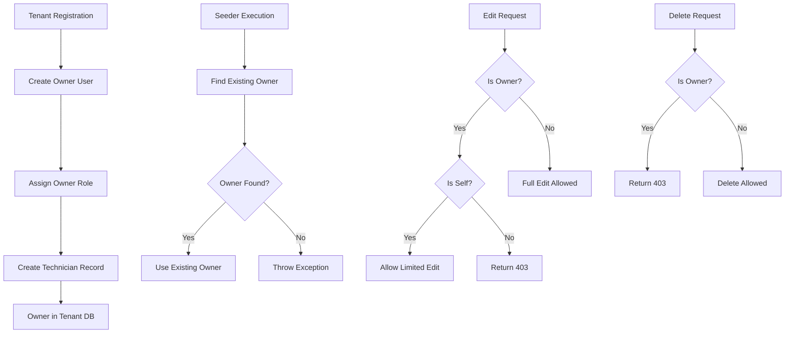

# 🛡️ Owner Protection System

> **CRITICAL**: Sistema de proteção do utilizador Owner - único por tenant

## Regras Fundamentais

### 1. **Um Único Owner por Tenant**
- ✅ **Criado automaticamente** durante registo do tenant (`TenantController::register()`)
- ✅ **Nunca criado por seeders** - seeders devem usar o Owner existente
- ✅ **Email único**: Definido durante registo, não pode ser alterado
- ❌ **Não pode ser eliminado**: Proteção em backend e frontend

### 2. **Edição Limitada**
**Owner pode editar-se a si próprio:**
- ✅ `name` - Nome de apresentação
- ✅ `hourly_rate` - Taxa horária
- ✅ `worker_id` - ID de trabalhador
- ✅ `worker_name` - Nome legal
- ✅ `worker_contract_country` - País de contrato
- ✅ `password` - Palavra-passe

**NÃO pode editar:**
- ❌ `email` - Fixo, definido no registo
- ❌ `role` / Spatie Roles - Sempre "Owner"

**Outros utilizadores:**
- ❌ Não podem editar o Owner (qualquer campo)

### 3. **Proteção contra Eliminação**
- ❌ Owner não pode ser eliminado (backend retorna 403)
- ❌ Botão de delete desabilitado no frontend
- ❌ Validação em `TechnicianController::destroy()`

---

## Implementação Backend

### Registo do Tenant (TenantController.php)
```php
// Linha 103-116: Criação automática do Owner
$owner = User::create([
    'name' => $request->admin_name,
    'email' => $request->admin_email,
    'password' => Hash::make($request->admin_password),
    'email_verified_at' => now(),
]);

$owner->assignRole('Owner');

// Technician record criado automaticamente
\App\Models\Technician::create([
    'name' => $owner->name,
    'email' => $owner->email,
    'role' => 'owner',
    'user_id' => $owner->id,
]);
```

### Proteção na Edição (TechnicianController.php)
```php
// Linha 140-176: Validação de edição
public function update(Request $request, Technician $technician): JsonResponse
{
    $isOwner = $technician->user && $technician->user->hasRole('Owner');
    
    if ($isOwner) {
        // Owner só pode editar a si próprio
        if ($technician->user_id !== $request->user()->id) {
            return response()->json([
                'message' => 'Owner users cannot be edited by other users.'
            ], 403);
        }
        
        // Campos permitidos para Owner (SEM email e role)
        $validated = $request->validate([
            'name' => 'string|max:255',
            'hourly_rate' => 'nullable|numeric|min:0',
            'worker_id' => ['nullable','string','max:64', 
                Rule::unique('technicians','worker_id')->ignore($technician->id)],
            'worker_name' => 'nullable|string|max:255',
            'worker_contract_country' => 'nullable|string|max:255',
            'password' => 'nullable|string|min:6',
        ]);
    }
}
```

### Proteção na Eliminação (TechnicianController.php)
```php
// Linha 208-221: Prevenção de eliminação
public function destroy(Technician $technician): JsonResponse
{
    if ($technician->user && $technician->user->hasRole('Owner')) {
        return response()->json([
            'message' => 'Owner users cannot be deleted.'
        ], 403);
    }
    
    $technician->delete();
    return response()->json(['message' => 'Technician deleted successfully']);
}
```

---

## Implementação Frontend

### UsersManager.tsx - Controlo de Acesso
```tsx
// Linha 330-340: Lógica de permissões
const isOwner = user.is_owner;
const isOwnUser = user.user_id === currentUser?.id;
const canEdit = !isOwner || isOwnUser; // Owner só pode editar-se
const canDelete = !isOwner; // Owner NUNCA pode ser eliminado

// Botões desabilitados conforme permissões
<IconButton disabled={!canEdit}>
  <EditIcon />
</IconButton>
<IconButton disabled={!canDelete}>
  <DeleteIcon />
</IconButton>
```

### Formulário de Edição (UsersManager.tsx)
```tsx
// Linha 463-485: Campos bloqueados para Owner
<TextField
  label="Email"
  disabled={editingUser?.is_owner === true}
  helperText={editingUser?.is_owner ? "Owner email cannot be changed" : ""}
/>

<TextField
  label="Role"
  select
  disabled={editingUser?.is_owner === true}
  helperText={editingUser?.is_owner ? "Owner role cannot be changed" : ""}
/>
```

### Badge Visual (UsersManager.tsx)
```tsx
// Linha 235-250: Badge amarelo para Owner
{isOwner && (
  <Chip
    label="Owner"
    size="small"
    sx={{
      bgcolor: '#fbbf2415',
      color: '#fbbf24',
      fontWeight: 600,
      border: '1px solid #fbbf24',
    }}
  />
)}
```

---

## Seeders - IMPORTANTE

### ❌ NÃO FAZER
```php
// ERRADO: Criar novo Owner no seeder
$owner = User::create([
    'email' => 'owner@example.com',
    'name' => 'System Owner',
]);
$owner->assignRole('Owner');
```

### ✅ FAZER
```php
// CORRETO: Usar Owner existente (CompleteTenantSeeder.php)
private function createUsers(): array
{
    // Get existing Owner (created during tenant registration)
    $owner = User::whereHas('roles', function($q) {
        $q->where('name', 'Owner');
    })->first();

    if (!$owner) {
        throw new \Exception('Owner user not found. Run this seeder only after tenant registration.');
    }

    // Continuar com criação de outros utilizadores (Admin, Manager, Technician...)
}
```

---

## Verificação de Integridade

### Verificar Único Owner no Tenant
```bash
docker exec -it timesheet_app php artisan tinker --execute="
\$tenant = App\Models\Tenant::first();
tenancy()->initialize(\$tenant);
\$ownerCount = App\Models\User::whereHas('roles', function(\$q) {
  \$q->where('name', 'Owner');
})->count();
echo 'Total Owners: ' . \$ownerCount . PHP_EOL;
// Deve retornar: Total Owners: 1
"
```

### Verificar Permissões do Owner
```bash
docker exec -it timesheet_app php artisan tinker --execute="
\$tenant = App\Models\Tenant::first();
tenancy()->initialize(\$tenant);
\$owner = App\Models\User::whereHas('roles', function(\$q) {
  \$q->where('name', 'Owner');
})->first();
echo 'Owner: ' . \$owner->name . PHP_EOL;
echo 'Email: ' . \$owner->email . PHP_EOL;
echo 'Total Permissions: ' . \$owner->getAllPermissions()->count() . PHP_EOL;
// Owner deve ter TODAS as permissões (27 atualmente)
"
```

---

## Common Pitfalls

1. **Seeder criando Owner**: Seeders devem usar `whereHas('roles')` para obter Owner existente
2. **Múltiplos Owners**: Sempre verificar que existe apenas 1 Owner por tenant
3. **Email editável**: Frontend/Backend devem bloquear edição de email do Owner
4. **Role editável**: Role "Owner" é imutável, nunca deve ser alterado
5. **Tentativa de eliminação**: Backend retorna 403, frontend desabilita botão
6. **Owner editando outros**: Owner só pode editar-se a si próprio

---

## Fluxo de Dados



---

## Responsabilidades

### Backend
- ✅ Criar Owner durante registo de tenant
- ✅ Validar que só existe 1 Owner por tenant
- ✅ Bloquear edição de email/role do Owner
- ✅ Bloquear eliminação do Owner (403)
- ✅ Atribuir automaticamente TODAS as permissões ao Owner

### Frontend
- ✅ Desabilitar botão de delete para Owner
- ✅ Desabilitar campos email/role quando editar Owner
- ✅ Permitir Owner editar apenas a si próprio
- ✅ Mostrar badge visual amarelo (#fbbf24) para Owner

### Seeders
- ✅ NUNCA criar novo Owner
- ✅ Usar `whereHas('roles')` para encontrar Owner existente
- ✅ Lançar exceção se Owner não existir

---

## Testing Checklist

- [ ] Registo de novo tenant cria Owner automaticamente
- [ ] Owner tem email e role não editáveis
- [ ] Owner pode editar próprio nome/password
- [ ] Outros utilizadores não podem editar Owner
- [ ] Tentativa de eliminar Owner retorna 403
- [ ] Frontend desabilita botão delete para Owner
- [ ] Badge amarelo aparece ao lado do nome do Owner
- [ ] Seeder não cria novo Owner (usa existente)
- [ ] Existe apenas 1 Owner por tenant
- [ ] Owner tem todas as permissões (27 atualmente)
